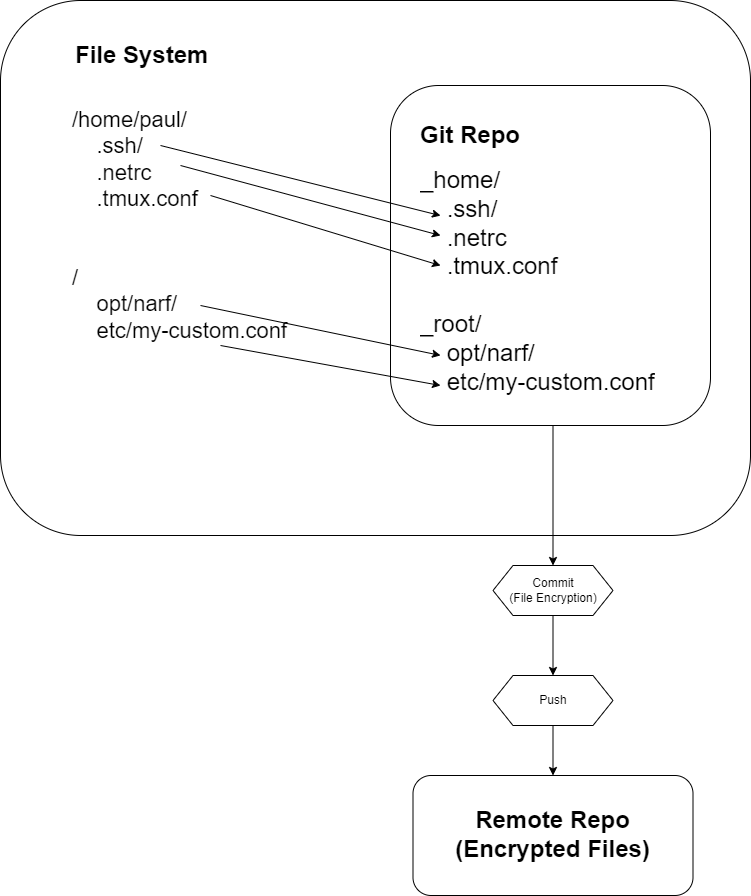

# How Neutron Sync Works

## Problem

When using multiple machines you often need to copy multiple files around so that you can work. These files are often sensitive and contain personal configurations. It is extremely useful to keep these files synced across devices. Git is a great mechanism for synchronizing changes across files; however, it is not encrypted and the files in this context are spread around you're filesystem and not centralized.

## Solution

Neutron Sync combines Git with git-crypt for encryption and then manages links across your file system so that files can be stored centrally in the repository.

When you link a file with Neutron Sync automates the following:

1. Moves the file into your encrypted repository.
1. Creates a link at the original location into the repository.
1. Records file permissions.
1. Commits and pushes changes.

When you pull files on another machine Neutron Sync automates the following:

1. Pull git changes.
1. Recreate links if needed.
1. Apply file permissions.

